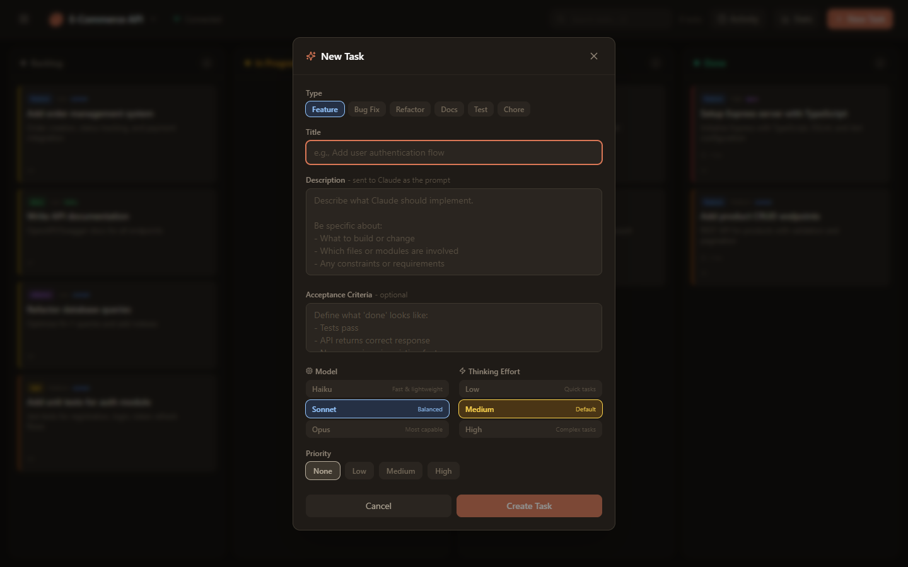
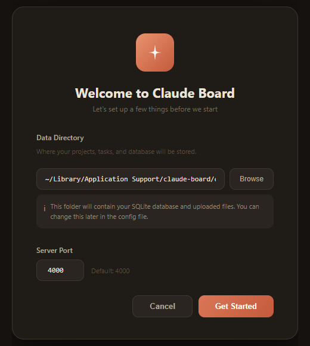
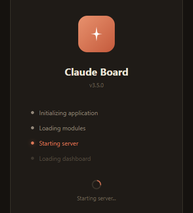

<div align="center">

# Claude Board

**AI-powered task management platform that orchestrates Claude to autonomously execute development tasks.**

[](https://github.com/bahri-hirfanoglu/claude-board/releases)
[](LICENSE)
[](https://v2.tauri.app)
[](https://www.rust-lang.org)
[](https://nodejs.org)

[Features](#features) &bull; [Download](#download) &bull; [Quick Start](#quick-start) &bull; [Screenshots](#screenshots) &bull; [Documentation](#documentation) &bull; [Architecture](#architecture) &bull; [Contributing](#contributing)


</div>

---

## What is Claude Board?

Claude Board is a self-hosted Kanban-style project management tool that integrates directly with [Claude Code CLI](https://docs.anthropic.com/en/docs/claude-code). Create tasks, drag them to "In Progress", and Claude autonomously writes code, creates branches, and commits changes &mdash; all while you watch the live terminal output.

Think of it as **Jira meets AI pair programming**: you define what needs to be done, Claude does the coding, you review and approve.

## Download

### Desktop App

Download the latest version for your platform:

| Platform | Download | Notes |
|----------|----------|-------|
| **Windows** | [ClaudeBoard-Setup.exe](https://github.com/bahri-hirfanoglu/claude-board/releases/latest) | NSIS installer |
| **macOS (Intel)** | [ClaudeBoard-x64.dmg](https://github.com/bahri-hirfanoglu/claude-board/releases/latest) | Intel Macs |
| **macOS (Apple Silicon)** | [ClaudeBoard-arm64.dmg](https://github.com/bahri-hirfanoglu/claude-board/releases/latest) | M1/M2/M3/M4 Macs |
| **Linux** | [ClaudeBoard.AppImage](https://github.com/bahri-hirfanoglu/claude-board/releases/latest) | Universal Linux |
| **Linux (Debian)** | [ClaudeBoard.deb](https://github.com/bahri-hirfanoglu/claude-board/releases/latest) | Ubuntu/Debian |

> **Note:** Claude Code CLI must be installed and authenticated on your system for task execution to work.

## Features

- **Planning Mode** &mdash; AI-powered task breakdown &mdash; describe what to build and Claude explores your codebase, then generates structured tasks with live progress tracking
- **Kanban Board** &mdash; Drag-and-drop tasks across Backlog, In Progress, Testing, Done
- **Multiple Views** &mdash; Switch between Board, List, Timeline, and Summary views
- **Timeline View** &mdash; Gantt-style visualization with gradient bars, today marker, and status legend
- **Autonomous Execution** &mdash; Claude CLI auto-starts when tasks move to In Progress
- **Live Terminal** &mdash; Watch Claude's tool calls, file edits, and bash commands in real-time with collapsible detail cards
- **Diff Preview** &mdash; See file change statistics (insertions/deletions) for completed tasks
- **Review System** &mdash; Approve completed work or request changes with revision feedback (Jira-style)
- **Context Snippets** &mdash; Define project rules and context that auto-inject into every Claude prompt
- **Prompt Templates** &mdash; Reusable task templates with variable substitution
- **File Attachments** &mdash; Attach reference files to tasks for Claude to use during execution
- **Webhook Notifications** &mdash; Send task events to Slack, Discord, Microsoft Teams, or custom HTTP endpoints
- **Task Queue** &mdash; Enable auto-queue to chain tasks &mdash; when one finishes, the next starts automatically
- **Smart Timer** &mdash; Work duration pauses when tasks enter Testing, resumes on return to In Progress
- **Git Automation** &mdash; Auto-create feature branches from task titles and optional auto-PR creation
- **Live Token Tracking** &mdash; Real-time token consumption and cost updates, saved even if stopped mid-task
- **Activity Timeline** &mdash; Chronological event feed of all project actions
- **Claude Usage Dashboard** &mdash; Token stats, model breakdown, cost analysis, 30-day sparkline, rate limit status
- **Multi-Project** &mdash; Manage multiple projects with custom avatars and working directories
- **CLAUDE.md Editor** &mdash; Edit project-level Claude configuration directly from the UI
- **Permission Modes** &mdash; Auto-accept, allow specific tools, or default Claude permissions per project
- **Model Selection** &mdash; Choose Opus, Sonnet, or Haiku per task with thinking effort levels
- **Desktop App** &mdash; Native Windows (.exe), macOS (.dmg), and Linux (AppImage/deb) builds via Tauri
- **Mobile Responsive** &mdash; Full mobile support with touch-friendly task move buttons
- **Task Keys** &mdash; Jira-style task identifiers (e.g. `FTR-CB-1001`) auto-generated from task type, project key, and counter
- **Status Transition Animations** &mdash; Particle effects on status change &mdash; sparks (In Progress), shimmer (Testing), confetti (Done), rewind (backward)
- **Model Filter** &mdash; Filter tasks by AI model (Haiku/Sonnet/Opus) across all views from the board toolbar
- **Voice Assistant** &mdash; Built-in voice assistant with speech recognition and text-to-speech for hands-free task management
- **Voice Dictation** &mdash; Mic buttons on task creation form for dictating title and description
- **Advanced Timeline** &mdash; Zoom controls (Day/Week/Month), collapsible status swimlanes, weekend shading, hover tooltips with rich details, audio waveform visualizer
- **Keyboard Shortcuts** &mdash; Alt+V to toggle voice assistant microphone

### Webhook Notifications

Send real-time notifications when tasks are created, started, completed, or revised:

| Platform | Payload Format | Setup |
|----------|---------------|-------|
| **Slack** | Block Kit messages | Incoming Webhook URL |
| **Discord** | Rich embeds with colors | Webhook URL from channel settings |
| **Microsoft Teams** | MessageCard format | Incoming Webhook connector |
| **Custom** | JSON payload | Any HTTP endpoint |

Configure webhooks per project from the project menu. Filter which events trigger notifications, test connectivity with one click, and enable/disable without deleting.

## Screenshots

### Dashboard

*Project overview with Claude usage statistics, model breakdown, and 30-day usage sparkline*

### Kanban Board

*Drag-and-drop task management with live status indicators*

### Task Creation

*Create tasks with type, model, thinking effort, and priority selection*

### Project Statistics

*Project statistics with status breakdown, model usage, and completion timeline*

### Activity Timeline

*Chronological feed of all project events*

### Desktop App

#### Setup Wizard


*First-run configuration &mdash; choose your data directory*

#### Splash Screen


*Loading progress with step-by-step status updates*

## Quick Start

### Prerequisites

- [Rust](https://www.rust-lang.org/tools/install) (latest stable toolchain)
- [Node.js](https://nodejs.org) >= 18.0.0
- [Claude Code CLI](https://docs.anthropic.com/en/docs/claude-code) installed and authenticated

### Install from Source

```bash
git clone https://github.com/bahri-hirfanoglu/claude-board.git
cd claude-board
npm install
cd client && npm install && cd ..
npx tauri dev
```

### Build Desktop Installers

```bash
npx tauri build
```

Built artifacts are saved to `src-tauri/target/release/bundle/`.

## Configuration

### Project Settings

Each project can be configured with:

| Setting | Options | Description |
|---------|---------|-------------|
| **Permission Mode** | `auto-accept`, `allow-tools`, `default` | How Claude handles tool permissions |
| **Auto Queue** | on/off | Automatically start next backlog task when current finishes |
| **Max Concurrent** | 1-5 | Maximum parallel tasks (when auto-queue is enabled) |
| **Auto Branch** | on/off | Create feature branches from task titles |
| **Auto PR** | on/off | Create pull requests when tasks complete |
| **Webhooks** | Slack/Discord/Teams/Custom | Send notifications on task events |

### Task Settings

| Setting | Options | Description |
|---------|---------|-------------|
| **Model** | `opus`, `sonnet`, `haiku` | Claude model to use |
| **Thinking Effort** | `low`, `medium`, `high` | Claude's thinking depth |
| **Priority** | 0-3 | Task priority (affects queue order) |
| **Type** | `feature`, `bugfix`, `refactor`, `docs`, `test`, `chore` | Task classification |

## Documentation

For detailed guides, concepts, and feature documentation, visit the **[Claude Board Docs](https://docs.claboard.dev/)**.

The documentation covers:

- **Getting Started** &mdash; Installation, quick start, and first project setup
- **Concepts** &mdash; Board & views, tasks, agents, and the review system
- **Features** &mdash; Live terminal, auto-queue, git automation, webhooks, and prompt templates

## Architecture

```
claude-board/
  src-tauri/                          # Rust backend (Tauri v2)
    src/
      main.rs                         # Entry point, Tauri setup
      db/
        mod.rs                        # SQLite init (rusqlite), query helpers
        schema.rs                     # Tables + migrations
        projects.rs                   # Project queries
        tasks.rs                      # Task queries
        stats.rs                      # Statistics queries
        activity.rs                   # Activity log queries
        snippets.rs                   # Context snippet queries
        templates.rs                  # Prompt template queries
        webhooks.rs                   # Webhook configuration queries
        attachments.rs                # File attachment queries
      claude/
        runner.rs                     # Claude CLI process management
        events.rs                     # Stream event parser
        prompt.rs                     # Task prompt builder
      commands/                       # Tauri command handlers (IPC)
      services/
        webhook_dispatcher.rs         # Webhook payload builder & HTTP dispatcher
    Cargo.toml                        # Rust dependencies
    tauri.conf.json                   # Tauri configuration

  client/src/                         # React frontend
    app/                              # Application shell
    hooks/                            # Custom React hooks
      useVoiceInput.js                # Web Speech API hook
      useKeyboardShortcut.js          # Keyboard shortcut hook
    lib/                              # Shared utilities
    features/                         # Feature modules
      board/                          # Kanban, List, Timeline, Summary views
      snippets/                       # Context snippets manager
      templates/                      # Prompt templates manager
      webhooks/                       # Webhook configuration UI
      terminal/                       # Live output viewer
      stats/                          # Statistics panel
      activity/                       # Activity timeline
      dashboard/                      # Home dashboard
      projects/                       # Header, ProjectModal
      tasks/                          # TaskModal, ReviewModal, TaskDetailModal
      editor/                         # CLAUDE.md editor
      voice/                          # Voice assistant
        engine/                       # TTS, STT analyser, sound effects
        intent/                       # Intent parser, entity extractors
        commands/                     # Plugin-based command modules
        components/                   # ChatPanel, AudioVisualizer, CommandHints
    components/                       # Shared UI
```

### Tech Stack

| Layer | Technology |
|-------|-----------|
| **Backend** | Rust, Tauri v2, Tauri Events (IPC) |
| **Frontend** | React 18, Vite, Tailwind CSS |
| **Database** | SQLite (via rusqlite, zero config) |
| **Desktop** | Tauri v2 |
| **Icons** | Lucide React |
| **Avatars** | Boring Avatars |
| **Markdown** | @uiw/react-md-editor |
| **AI** | Claude Code CLI |

### Data Flow

```
User creates task
  -> Drags to "In Progress"
  -> Rust backend spawns Claude CLI process
  -> Claude reads/writes code, runs commands
  -> Stream events parsed in real-time
  -> Tauri events push updates to frontend
  -> Live terminal shows progress
  -> Token usage tracked per turn
  -> Webhook notifications dispatched to configured services
  -> Claude finishes -> task moves to "Testing" (timer pauses)
  -> User reviews -> Approve (Done) or Request Changes (back to In Progress, timer resumes)
```

## Contributing

See [CONTRIBUTING.md](CONTRIBUTING.md) for development setup and guidelines.

## License

This project is licensed under the MIT License. See [LICENSE](LICENSE) for details.

---

<div align="center">
  Built with Claude Code
</div>
