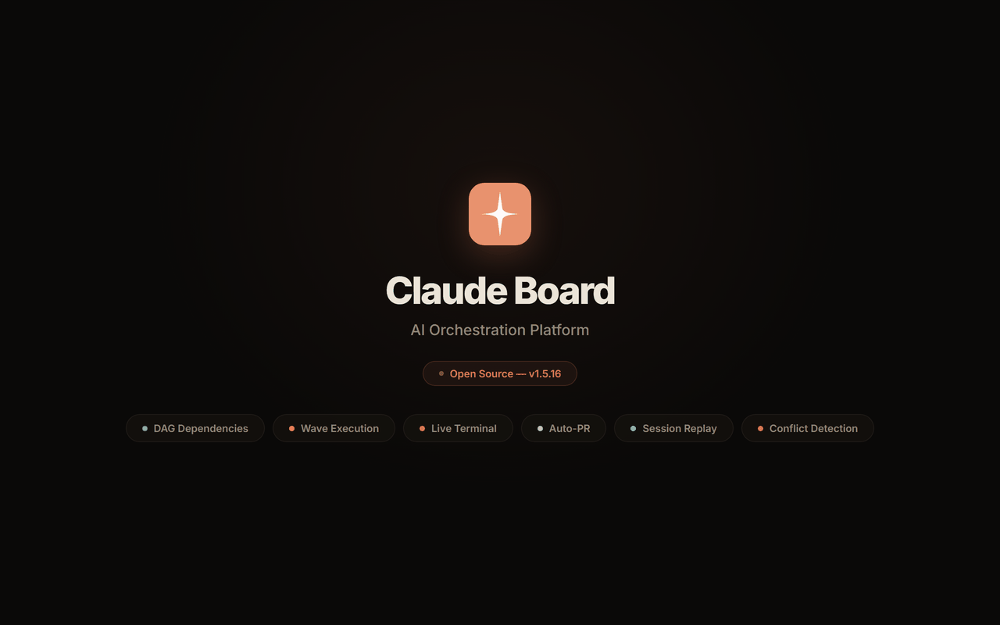

<p align="center">
  
</p>

<div align="center">

# Claude Board

**AI-powered task management platform that orchestrates autonomous development agents.**

[](https://github.com/bahri-hirfanoglu/claude-board/releases)
[](https://github.com/bahri-hirfanoglu/claude-board/releases)
[](LICENSE)
[](https://v2.tauri.app)
[](https://www.rust-lang.org)
[](https://nodejs.org)

[Features](#features) &bull; [Download](#download) &bull; [Quick Start](#quick-start) &bull; [Documentation](#documentation) &bull; [Contributing](#contributing)

</div>

<p align="center">
  
</p>

---

## What is Claude Board?

Claude Board is a self-hosted Kanban-style project management tool that integrates with AI coding agents. Create tasks, drag them to "In Progress", and agents autonomously write code, create branches, and commit changes &mdash; all while you watch the live terminal output.

Think of it as **Jira meets AI pair programming**: you define what needs to be done, agents do the coding, you review and approve.

## Download

### Desktop App

Download the latest version for your platform:

| Platform | Download | Notes |
|----------|----------|-------|
| **Windows** | [ClaudeBoard-Setup.exe](https://github.com/bahri-hirfanoglu/claude-board/releases/latest) | NSIS installer |
| **macOS (Intel)** | [ClaudeBoard-x64.dmg](https://github.com/bahri-hirfanoglu/claude-board/releases/latest) | Intel Macs |
| **macOS (Apple Silicon)** | [ClaudeBoard-arm64.dmg](https://github.com/bahri-hirfanoglu/claude-board/releases/latest) | M1/M2/M3/M4 Macs |
| **Linux** | [ClaudeBoard.AppImage](https://github.com/bahri-hirfanoglu/claude-board/releases/latest) | Universal Linux |
| **Linux (Debian)** | [ClaudeBoard.deb](https://github.com/bahri-hirfanoglu/claude-board/releases/latest) | Ubuntu/Debian |

> **macOS users:** If you see _"Claude Board.app is damaged and can't be opened"_, run this in Terminal after installing:
> ```bash
> xattr -cr /Applications/Claude\ Board.app
> ```
> This removes the macOS quarantine flag. The app is not code-signed with an Apple Developer certificate yet, which triggers this Gatekeeper warning.

## Features

### Orchestration & Planning
- **Multi-Agent Orchestration** &mdash; DAG-based dependency graph with visual mission control, drag-to-connect edges, and node repositioning
- **Planning Mode** &mdash; AI-powered task breakdown with DAG preview, review/approve/revise workflow
- **Roadmap & GSD Integration** &mdash; Milestones and phases with structured phase descriptions (Goal, Requirements, Success Criteria, Plans, Execution Order tables), PLAN.md task preview before task generation, and PROJECT.md / STATE.md overview for [GSD](https://github.com/bahri-hirfanoglu/gsd) spec-driven projects
- **Task Dependencies** &mdash; Multi-parent DAG dependencies with cycle detection and wave-based execution
- **Task Queue** &mdash; Auto-queue to chain tasks with configurable concurrency (1-50 agents)

### Execution & Testing
- **Live Terminal** &mdash; Watch agent tool calls, file edits, and bash commands in real-time with expandable cards
- **Project Terminal** &mdash; Unified tab that streams every active task's logs side-by-side with color-coded `[TASK-KEY]` per-line badges; split-grid mode gives each agent its own auto-scrolling pane
- **Split Terminal** &mdash; View multiple agent outputs side by side (vertical or horizontal split)
- **Auto Test** &mdash; Automatic verification of completed tasks &mdash; runs tests, checks acceptance criteria, auto-approves on success
- **Session Replay** &mdash; Timeline-based replay of agent actions with color-coded event types
- **Diff Viewer** &mdash; Unified diff display of code changes with syntax highlighting

### Project Management
- **Kanban Board** &mdash; Drag-and-drop tasks across Backlog, In Progress, Testing, Done
- **Multiple Views** &mdash; Board, List, Pipeline, Orchestration, Analytics, Roadmap, and Terminal views
- **Review System** &mdash; Approve completed work or request changes with revision feedback
- **Enhanced Dashboard** &mdash; Priority/model/type distribution, top-cost tasks, throughput metrics

### AI Configuration
- **Skill Import** &mdash; Browse and install skills from GitHub repositories (awesome-claude-code, etc.)
- **Roles** &mdash; Specialized agent personas with custom system prompts
- **Context Snippets & Prompt Templates** &mdash; Reusable rules, context, and templates with variable substitution
- **Codebase Scan** &mdash; AI-powered project analysis for better context

### Git & Integrations
- **Git Automation** &mdash; Auto-create feature branches and optional auto-PR creation
- **Webhook Notifications** &mdash; Send task events to Slack, Discord, Microsoft Teams, or custom endpoints
- **Manager Dashboard** &mdash; Manage MCP servers, plugins, agents, hooks, sessions, and settings

### Platform
- **Desktop App** &mdash; Native Windows, macOS, and Linux builds via Tauri v2 with auto-updater
- **Live Token Tracking** &mdash; Real-time token consumption and cost updates
- **Multi-Project** &mdash; Manage multiple projects with custom avatars and working directories
- **Model Selection** &mdash; Choose Opus, Sonnet, or Haiku per task with thinking effort levels
- **Mobile Responsive** &mdash; Full mobile support with touch-friendly controls

See the [Documentation](https://docs.claboard.dev) for detailed guides.

## Quick Start

### Prerequisites

- [Rust](https://www.rust-lang.org/tools/install) (latest stable toolchain)
- [Node.js](https://nodejs.org) >= 18.0.0
- AI coding CLI installed and authenticated

### Install from Source

```bash
git clone https://github.com/bahri-hirfanoglu/claude-board.git
cd claude-board
npm install
cd client && npm install && cd ..
npx tauri dev
```

### Build Desktop Installers

```bash
npx tauri build
```

Built artifacts are saved to `src-tauri/target/release/bundle/`.

## Documentation

For detailed guides, concepts, and feature documentation, visit the **[Claude Board Docs](https://docs.claboard.dev/)**.

## Contributing

See [CONTRIBUTING.md](CONTRIBUTING.md) for development setup and guidelines.

## License

This project is licensed under the MIT License. See [LICENSE](LICENSE) for details.
