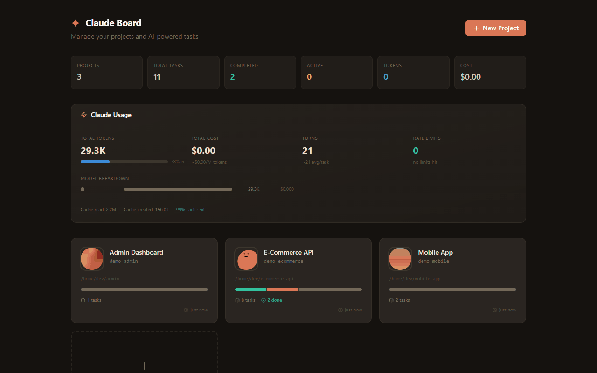
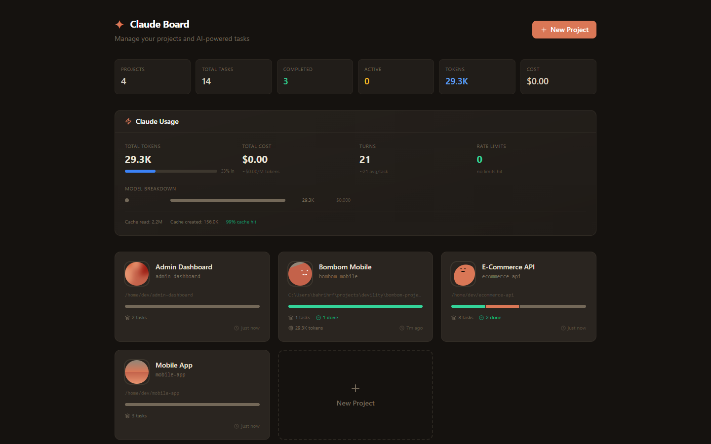
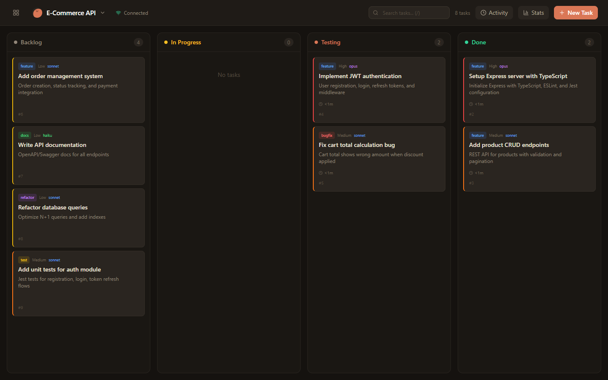
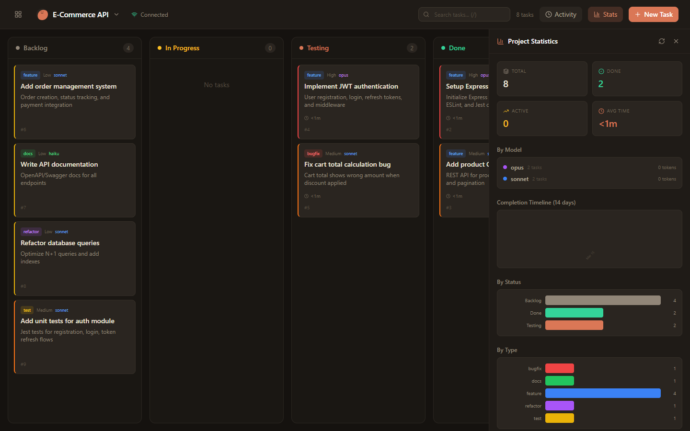
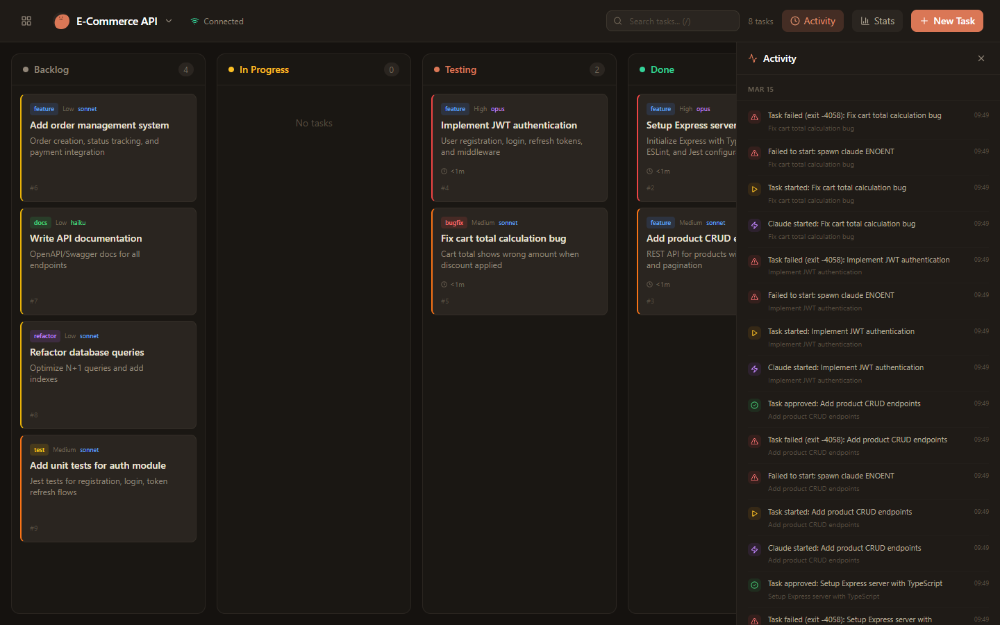
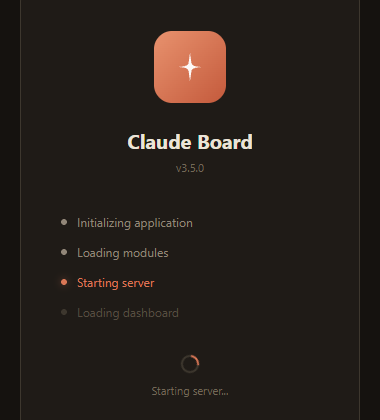

<div align="center">

# Claude Board

**AI-powered task management platform that orchestrates Claude to autonomously execute development tasks.**

[](https://github.com/bahri-hirfanoglu/claude-board/releases)
[](LICENSE)
[](https://nodejs.org)
[](Dockerfile)
[](https://github.com/bahri-hirfanoglu/claude-board/releases)

[Features](#features) &bull; [Download](#download) &bull; [Quick Start](#quick-start) &bull; [Screenshots](#screenshots) &bull; [Architecture](#architecture) &bull; [API](#api-reference) &bull; [Contributing](#contributing)



</div>

---

## What is Claude Board?

Claude Board is a self-hosted Kanban-style project management tool that integrates directly with [Claude Code CLI](https://docs.anthropic.com/en/docs/claude-code). Create tasks, drag them to "In Progress", and Claude autonomously writes code, creates branches, and commits changes &mdash; all while you watch the live terminal output.

Think of it as **Jira meets AI pair programming**: you define what needs to be done, Claude does the coding, you review and approve.

## Download

### Desktop App

Download the latest version for your platform:

| Platform | Download | Notes |
|----------|----------|-------|
| **Windows** | [ClaudeBoard-Setup.exe](https://github.com/bahri-hirfanoglu/claude-board/releases/latest) | NSIS installer with desktop shortcut |
| **Windows Portable** | [ClaudeBoard-Portable.exe](https://github.com/bahri-hirfanoglu/claude-board/releases/latest) | No installation required |
| **macOS (Intel)** | [ClaudeBoard-x64.dmg](https://github.com/bahri-hirfanoglu/claude-board/releases/latest) | Intel Macs |
| **macOS (Apple Silicon)** | [ClaudeBoard-arm64.dmg](https://github.com/bahri-hirfanoglu/claude-board/releases/latest) | M1/M2/M3/M4 Macs |
| **Linux** | [ClaudeBoard.AppImage](https://github.com/bahri-hirfanoglu/claude-board/releases/latest) | Universal Linux |
| **Linux (Debian)** | [ClaudeBoard.deb](https://github.com/bahri-hirfanoglu/claude-board/releases/latest) | Ubuntu/Debian |

> **Note:** Claude Code CLI must be installed and authenticated on your system for task execution to work.

## Features

- **Kanban Board** &mdash; Drag-and-drop tasks across Backlog, In Progress, Testing, Done
- **Multiple Views** &mdash; Switch between Board, List, Timeline, and Summary views
- **Timeline View** &mdash; Gantt-style visualization with gradient bars, today marker, and status legend
- **Autonomous Execution** &mdash; Claude CLI auto-starts when tasks move to In Progress
- **Live Terminal** &mdash; Watch Claude's tool calls, file edits, and bash commands in real-time with collapsible detail cards
- **Diff Preview** &mdash; See file change statistics (insertions/deletions) for completed tasks
- **Review System** &mdash; Approve completed work or request changes with revision feedback (Jira-style)
- **Context Snippets** &mdash; Define project rules and context that auto-inject into every Claude prompt
- **Prompt Templates** &mdash; Reusable task templates with variable substitution
- **File Attachments** &mdash; Attach reference files to tasks for Claude to use during execution
- **Webhook Notifications** &mdash; Send task events to Slack, Discord, Microsoft Teams, or custom HTTP endpoints
- **Task Queue** &mdash; Enable auto-queue to chain tasks &mdash; when one finishes, the next starts automatically
- **Smart Timer** &mdash; Work duration pauses when tasks enter Testing, resumes on return to In Progress
- **Git Automation** &mdash; Auto-create feature branches from task titles and optional auto-PR creation
- **Live Token Tracking** &mdash; Real-time token consumption and cost updates, saved even if stopped mid-task
- **Activity Timeline** &mdash; Chronological event feed of all project actions
- **Claude Usage Dashboard** &mdash; Token stats, model breakdown, cost analysis, 30-day sparkline, rate limit status
- **Multi-Project** &mdash; Manage multiple projects with custom avatars and working directories
- **CLAUDE.md Editor** &mdash; Edit project-level Claude configuration directly from the UI
- **Permission Modes** &mdash; Auto-accept, allow specific tools, or default Claude permissions per project
- **Model Selection** &mdash; Choose Opus, Sonnet, or Haiku per task with thinking effort levels
- **Desktop App** &mdash; Native Windows (.exe), macOS (.dmg), and Linux (AppImage/deb) builds via Electron
- **Mobile Responsive** &mdash; Full mobile support with touch-friendly task move buttons

### Webhook Notifications

Send real-time notifications when tasks are created, started, completed, or revised:

| Platform | Payload Format | Setup |
|----------|---------------|-------|
| **Slack** | Block Kit messages | Incoming Webhook URL |
| **Discord** | Rich embeds with colors | Webhook URL from channel settings |
| **Microsoft Teams** | MessageCard format | Incoming Webhook connector |
| **Custom** | JSON payload | Any HTTP endpoint |

Configure webhooks per project from the project menu. Filter which events trigger notifications, test connectivity with one click, and enable/disable without deleting.

## Screenshots

### Dashboard

*Project overview with Claude usage statistics, model breakdown, and 30-day usage sparkline*

### Kanban Board

*Drag-and-drop task management with live status indicators*

### Task Creation

*Create tasks with type, model, thinking effort, and priority selection*

### Project Statistics

*Project statistics with status breakdown, model usage, and completion timeline*

### Activity Timeline

*Chronological feed of all project events*

### Desktop App

#### Setup Wizard


*First-run configuration &mdash; choose your data directory and server port*

#### Splash Screen


*Loading progress with step-by-step status updates*

## Quick Start

### Prerequisites

- [Node.js](https://nodejs.org) >= 18.0.0
- [Claude Code CLI](https://docs.anthropic.com/en/docs/claude-code) installed and authenticated

### Install & Run

```bash
git clone https://github.com/bahri-hirfanoglu/claude-board.git
cd claude-board
npm run setup
npm run dev
```

Open [http://localhost:4000](http://localhost:4000) in your browser.

### Production

```bash
npm run build
npm start
```

### Docker

```bash
docker build -t claude-board .
docker run -p 4000:4000 -v claude-data:/app/data claude-board
```

Or with Docker Compose:

```bash
docker compose up -d
```

### Desktop App (Development)

```bash
npm run build
npm run electron:dev
```

### Build Desktop Installers

```bash
# Windows
npm run electron:build:win

# macOS
npm run electron:build:mac

# Linux
npm run electron:build:linux

# All platforms
npm run electron:build
```

Built artifacts are saved to `dist-electron/`.

## Configuration

### Environment Variables

| Variable | Default | Description |
|----------|---------|-------------|
| `PORT` | `4000` | Server port |

### Project Settings

Each project can be configured with:

| Setting | Options | Description |
|---------|---------|-------------|
| **Permission Mode** | `auto-accept`, `allow-tools`, `default` | How Claude handles tool permissions |
| **Auto Queue** | on/off | Automatically start next backlog task when current finishes |
| **Max Concurrent** | 1-5 | Maximum parallel tasks (when auto-queue is enabled) |
| **Auto Branch** | on/off | Create feature branches from task titles |
| **Auto PR** | on/off | Create pull requests when tasks complete |
| **Webhooks** | Slack/Discord/Teams/Custom | Send notifications on task events |

### Task Settings

| Setting | Options | Description |
|---------|---------|-------------|
| **Model** | `opus`, `sonnet`, `haiku` | Claude model to use |
| **Thinking Effort** | `low`, `medium`, `high` | Claude's thinking depth |
| **Priority** | 0-3 | Task priority (affects queue order) |
| **Type** | `feature`, `bugfix`, `refactor`, `docs`, `test`, `chore` | Task classification |

## Architecture

```
claude-board/
  server.js                         # Entry point
  electron/
    main.cjs                        # Electron main process (desktop app)

  src/                              # Backend modules
    app.js                          # Express + Socket.IO factory
    db/
      connection.js                 # SQLite init, query helpers
      schema.js                     # Tables + migrations
      projects.js                   # Project queries
      tasks.js                      # Task queries
      stats.js                      # Statistics queries
      activity.js                   # Activity log queries
      snippets.js                   # Context snippet queries
      templates.js                  # Prompt template queries
      webhooks.js                   # Webhook configuration queries
      attachments.js                # File attachment queries
      index.js                      # Barrel export
    claude/
      runner.js                     # Claude CLI process management
      events.js                     # Stream event parser
      prompt.js                     # Task prompt builder
    routes/
      projects.js                   # /api/projects
      tasks.js                      # /api/tasks
      stats.js                      # /api/stats, activity, CLAUDE.md
      snippets.js                   # /api/snippets
      templates.js                  # /api/templates
      webhooks.js                   # /api/webhooks
      attachments.js                # /api/attachments
    services/
      webhookDispatcher.js          # Webhook payload builder & HTTP dispatcher

  client/src/                       # React frontend
    app/                            # Application shell
    hooks/                          # Custom React hooks
    lib/                            # Shared utilities
    features/                       # Feature modules
      board/                        # Kanban, List, Timeline, Summary views
      snippets/                     # Context snippets manager
      templates/                    # Prompt templates manager
      webhooks/                     # Webhook configuration UI
      terminal/                     # Live output viewer
      stats/                        # Statistics panel
      activity/                     # Activity timeline
      dashboard/                    # Home dashboard
      projects/                     # Header, ProjectModal
      tasks/                        # TaskModal, ReviewModal, TaskDetailModal
      editor/                       # CLAUDE.md editor
    components/                     # Shared UI
```

### Tech Stack

| Layer | Technology |
|-------|-----------|
| **Backend** | Node.js, Express, Socket.IO |
| **Frontend** | React 18, Vite, Tailwind CSS |
| **Database** | SQLite (via sql.js, zero config) |
| **Desktop** | Electron, electron-builder |
| **Icons** | Lucide React |
| **Avatars** | Boring Avatars |
| **Markdown** | @uiw/react-md-editor |
| **AI** | Claude Code CLI |

### Data Flow

```
User creates task
  -> Drags to "In Progress"
  -> Server spawns Claude CLI process
  -> Claude reads/writes code, runs commands
  -> Stream events parsed in real-time
  -> Live terminal shows progress
  -> Token usage tracked per turn
  -> Webhook notifications dispatched to configured services
  -> Claude finishes -> task moves to "Testing" (timer pauses)
  -> User reviews -> Approve (Done) or Request Changes (back to In Progress, timer resumes)
```

## API Reference

### Projects

| Method | Endpoint | Description |
|--------|----------|-------------|
| `GET` | `/api/projects` | List all projects |
| `GET` | `/api/projects/summary` | Projects with aggregated stats |
| `POST` | `/api/projects` | Create project |
| `PUT` | `/api/projects/:id` | Update project |
| `DELETE` | `/api/projects/:id` | Delete project |

### Tasks

| Method | Endpoint | Description |
|--------|----------|-------------|
| `GET` | `/api/projects/:id/tasks` | List tasks for project |
| `POST` | `/api/projects/:id/tasks` | Create task |
| `PUT` | `/api/tasks/:id` | Update task |
| `PATCH` | `/api/tasks/:id/status` | Change task status |
| `DELETE` | `/api/tasks/:id` | Delete task |
| `POST` | `/api/tasks/:id/stop` | Stop running Claude |
| `POST` | `/api/tasks/:id/restart` | Restart Claude |
| `POST` | `/api/tasks/:id/request-changes` | Request revision with feedback |
| `GET` | `/api/tasks/:id/revisions` | Get revision history |
| `GET` | `/api/tasks/:id/logs` | Get task logs |
| `GET` | `/api/tasks/:id/detail` | Get task with commits, revisions, attachments |

### Webhooks

| Method | Endpoint | Description |
|--------|----------|-------------|
| `GET` | `/api/projects/:id/webhooks` | List project webhooks |
| `POST` | `/api/projects/:id/webhooks` | Create webhook |
| `PUT` | `/api/webhooks/:id` | Update webhook |
| `DELETE` | `/api/webhooks/:id` | Delete webhook |
| `POST` | `/api/webhooks/:id/test` | Send test notification |

### Context Snippets

| Method | Endpoint | Description |
|--------|----------|-------------|
| `GET` | `/api/projects/:id/snippets` | List project snippets |
| `POST` | `/api/projects/:id/snippets` | Create snippet |
| `PUT` | `/api/snippets/:id` | Update snippet |
| `DELETE` | `/api/snippets/:id` | Delete snippet |

### Templates

| Method | Endpoint | Description |
|--------|----------|-------------|
| `GET` | `/api/projects/:id/templates` | List project templates |
| `POST` | `/api/projects/:id/templates` | Create template |
| `PUT` | `/api/templates/:id` | Update template |
| `DELETE` | `/api/templates/:id` | Delete template |

### Attachments

| Method | Endpoint | Description |
|--------|----------|-------------|
| `POST` | `/api/tasks/:id/attachments` | Upload files to task |
| `GET` | `/api/tasks/:id/attachments` | List task attachments |
| `DELETE` | `/api/attachments/:id` | Delete attachment |

### Stats & Activity

| Method | Endpoint | Description |
|--------|----------|-------------|
| `GET` | `/api/projects/:id/stats` | Project statistics |
| `GET` | `/api/projects/:id/activity` | Activity timeline |
| `GET` | `/api/stats/claude-usage` | Global Claude usage stats |

### Socket.IO Events

| Event | Direction | Description |
|-------|-----------|-------------|
| `task:created` | Server -> Client | New task created |
| `task:updated` | Server -> Client | Task data changed |
| `task:deleted` | Server -> Client | Task removed |
| `task:log` | Server -> Client | Live log entry |
| `task:usage` | Server -> Client | Live token update |
| `claude:limits` | Server -> Client | Rate limit status |
| `claude:finished` | Server -> Client | Claude process ended |

## Contributing

See [CONTRIBUTING.md](CONTRIBUTING.md) for development setup and guidelines.

## License

This project is licensed under the MIT License. See [LICENSE](LICENSE) for details.

---

<div align="center">
  Built with Claude Code
</div>
